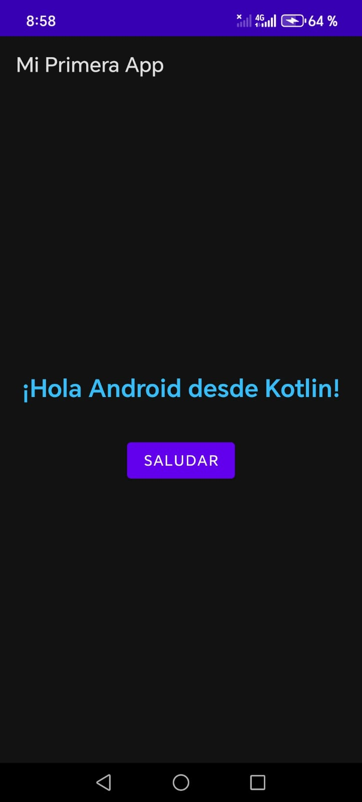
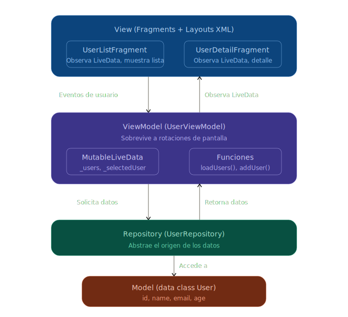
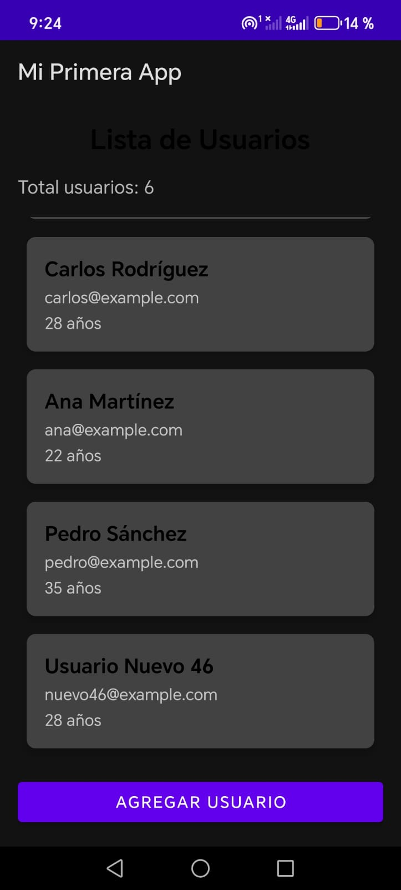
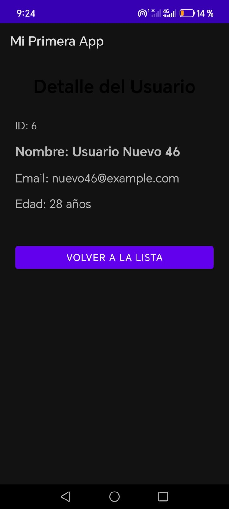

# Taller 1 - Hello Android Studio

## Información del Estudiante
- Nombre: Ariana Alexandra Duran Grimaldos
- Grupo: E191
- Fecha: 05/03/2026

## Respuestas

### 1. Función del AndroidManifest.xml
El archivo AndroidManifest.xml es el archivo de configuración central de toda aplicación Android.
Le declara al sistema operativo todo lo que necesita saber sobre la app antes de ejecutarla:
el nombre del paquete que la identifica de forma única, todas las Activities, Services y Receivers que la componen,
los permisos que solicita al usuario (como acceso a cámara o internet), el ícono y tema visual,
y cuál Activity es el punto de entrada (LAUNCHER). Sin este archivo, Android no puede instalar ni ejecutar la aplicación.

### 2. Diferencia entre activity_main.xml y MainActivity.kt
Son dos capas del mismo patrón de diseño: activity_main.xml define qué se ve (la interfaz), mientras que MainActivity.kt define qué hace (la lógica). El XML describe la estructura visual usando elementos como TextView, Button y sus atributos de posición, tamaño y color. El archivo Kotlin lee esos elementos en tiempo de ejecución mediante findViewById, y les asigna comportamiento: responder a clics, actualizar texto, mostrar mensajes, etc. Esta separación entre vista y lógica hace el código más organizado y mantenible.

### 3. Gestión de recursos en Android
Android gestiona los recursos limitados del dispositivo (memoria RAM, CPU, batería) mediante un ciclo de vida controlado de las Activities. El sistema puede pausar, detener o destruir una Activity cuando necesita liberar memoria para otra tarea, notificando al desarrollador con métodos como onPause(), onStop() y onDestroy(). Además, gestiona los recursos de la app (imágenes, textos, layouts) desde la carpeta res/, separándolos del código para poder adaptarlos automáticamente a diferentes tamaños de pantalla, idiomas e configuraciones de hardware sin modificar la lógica.

### 4. Aplicaciones famosas que usan Kotlin
Netflix — usa Kotlin en su app Android para la gestión de su interfaz de streaming y personalización de contenido.
Duolingo — migró su app Android completamente a Kotlin, aprovechando las corrutinas para manejar llamadas a la red de forma eficiente.
Pinterest — adoptó Kotlin para reducir los errores de NullPointerException y mejorar la legibilidad del código de su feed visual.

## Capturas de Pantalla



---

## Taller 2 - Arquitectura MVVM

### Respuestas a Preguntas Conceptuales

#### 1. ¿Qué problema resuelve el ViewModel en Android?
El ViewModel resuelve el problema de la pérdida de datos cuando ocurren cambios de configuración, como rotar la pantalla. Sin ViewModel, cada vez que el usuario rota el dispositivo la Activity se destruye y se vuelve a crear desde cero, perdiendo cualquier dato que estuviera en memoria (listas cargadas, formularios a medio llenar, estados de la UI). El ViewModel vive por fuera del ciclo de vida de la Activity, así que mantiene los datos intactos mientras la Activity se reconstruye. Además, al sacar la lógica de negocio de la Activity, el código queda más limpio y organizado: la Activity solo se encarga de mostrar cosas en pantalla, y el ViewModel se encarga de preparar y gestionar los datos.

#### 2. ¿Por qué LiveData es "lifecycle-aware" y qué beneficio trae?
LiveData es "lifecycle-aware" porque conoce el estado del ciclo de vida del componente que lo está observando (ya sea una Activity o un Fragment). Esto significa que solo envía actualizaciones cuando ese componente está en un estado activo (STARTED o RESUMED), y deja de notificar automáticamente si está en segundo plano o destruido. El beneficio principal es que evita crashes y memory leaks: no hay riesgo de que se intente actualizar una vista que ya no existe en pantalla. También elimina la necesidad de suscribirse y desuscribirse manualmente a los cambios de datos, porque LiveData lo maneja solo. En la práctica, uno simplemente observa el LiveData y la UI se actualiza de forma reactiva cada vez que los datos cambian, sin preocuparse por el ciclo de vida.

#### 3. Explica con tus propias palabras el flujo de datos en MVVM
El flujo de datos en MVVM funciona en una sola dirección y con capas bien separadas. Empieza desde abajo: el Model (en nuestro caso el Repository y la data class User) es el que tiene los datos, ya sea de una lista local, una base de datos o una API. El ViewModel le pide los datos al Repository y los almacena en objetos LiveData. La View (los Fragments) observa esos LiveData y cada vez que el ViewModel actualiza un valor, la UI se redibuja automáticamente con la información nueva. Cuando el usuario interactúa con la pantalla (por ejemplo, toca un botón para agregar un usuario), la View le avisa al ViewModel, el ViewModel le dice al Repository que haga el cambio, y luego el ViewModel actualiza el LiveData, lo que a su vez actualiza la pantalla. La clave es que la View nunca accede directamente al Repository ni al Model; siempre pasa por el ViewModel como intermediario.

#### 4. ¿Qué ventaja tiene usar Fragments vs múltiples Activities?
Los Fragments son más ligeros y flexibles que las Activities. Una Activity ocupa más recursos del sistema y tiene un ciclo de vida más pesado, mientras que un Fragment vive dentro de una Activity y comparte su contexto. La ventaja principal es que varios Fragments pueden convivir dentro de una sola Activity, lo que permite cambiar de pantalla sin destruir y crear Activities completas, haciendo las transiciones más fluidas y rápidas. Además, con el Navigation Component, manejar la navegación entre Fragments se vuelve declarativo y centralizado en un solo archivo (el nav_graph). Otra ventaja importante es que los Fragments pueden compartir datos fácilmente a través de un ViewModel con scope de Activity usando activityViewModels(), algo que entre Activities separadas requiere mecanismos más complicados como Intents o SharedPreferences.

#### 5. ¿Cómo ayuda el Repository Pattern a la arquitectura?
El Repository actúa como una capa de abstracción entre el ViewModel y las fuentes de datos. El ViewModel no sabe ni le importa de dónde vienen los datos: pueden venir de una lista en memoria, de una base de datos Room local o de una API REST remota. El Repository es el que decide de dónde obtenerlos y se encarga de esa lógica. Esto ayuda mucho a la arquitectura porque si mañana necesito cambiar la fuente de datos (por ejemplo, pasar de datos locales a una API real), solo modifico el Repository sin tocar nada del ViewModel ni de la UI. También facilita las pruebas unitarias, porque puedo crear un Repository falso (mock) que devuelva datos de prueba sin necesidad de conectarme a internet o a una base de datos real.

### Diagrama de Arquitectura



```
┌─────────────────────────────────────────────────────┐
│                      VIEW                           │
│            (Fragments + Layouts XML)                │
│                                                     │
│  UserListFragment          UserDetailFragment       │
│  - Observa LiveData        - Observa LiveData       │
│  - Muestra lista           - Muestra detalle        │
│  - Captura clicks          - Botón volver           │
└──────────────────────┬──────────────────────────────┘
                       │ observa ▲        │ eventos de
                       │ LiveData│        │ usuario ▼
                       ▼         │        ▼
┌─────────────────────────────────────────────────────┐
│                   VIEWMODEL                         │
│               (UserViewModel)                       │
│                                                     │
│  - _users: MutableLiveData<List<User>>              │
│  - _selectedUser: MutableLiveData<User?>            │
│  - _isLoading: MutableLiveData<Boolean>             │
│  - loadUsers(), selectUser(), addUser()             │
│  - Sobrevive a rotaciones de pantalla               │
└──────────────────────┬──────────────────────────────┘
                       │ solicita         │ recibe
                       │ datos ▼          │ datos ▲
                       ▼                  │
┌─────────────────────────────────────────────────────┐
│                  REPOSITORY                         │
│              (UserRepository)                       │
│                                                     │
│  - getAllUsers(), getUserById()                      │
│  - addUser(), updateUser(), deleteUser()            │
│  - Abstrae el origen de los datos                   │
└──────────────────────┬──────────────────────────────┘
                       │ accede a ▼
                       ▼
┌─────────────────────────────────────────────────────┐
│                    MODEL                            │
│              (Data Class User)                      │
│                                                     │
│  data class User(                                   │
│      val id: Int,                                   │
│      val name: String,                              │
│      val email: String,                             │
│      val age: Int                                   │
│  )                                                  │
└─────────────────────────────────────────────────────┘
```

### Capturas de Pantalla




"# andorid-mobile"